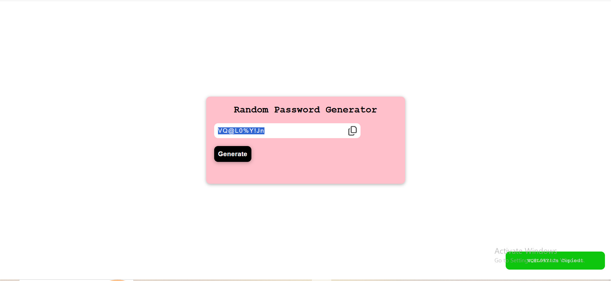

# Random Password Generator

A simple **Random Password Generator** built using **HTML, CSS, and Vanilla JavaScript**.  
The app generates a random password with a single click and allows users to copy it easily to the clipboard with a visual notification.

### Screenshot
